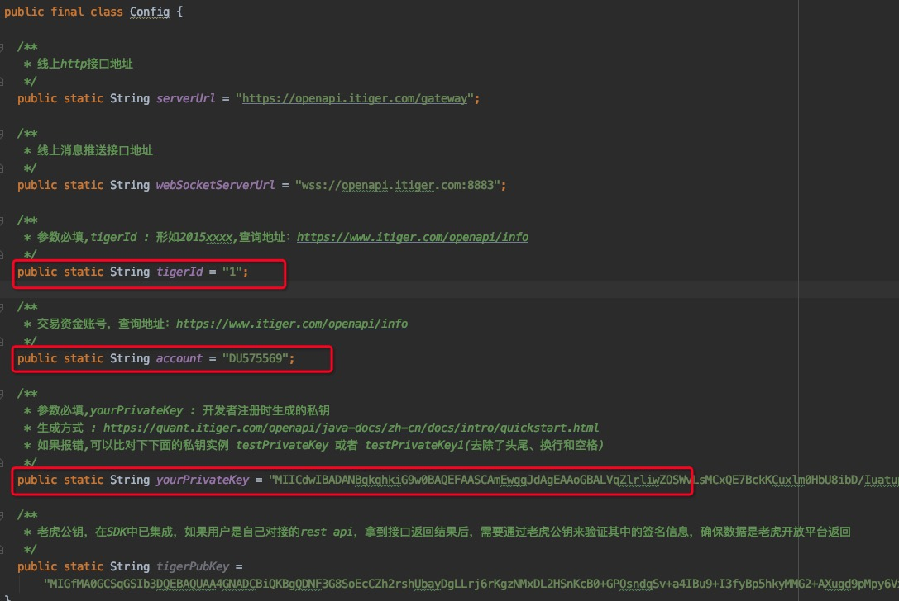

# openapi-java-sdk-demo

## 运行前准备
运行此项目前，需要在老虎证券完成开户入金，然后注册成为开发者
开发者信息注册说明：
https://quant.itiger.com/openapi/java-docs/zh-cn/docs/intro/quickstart.html

## 配置修改
运行示例前，请修改 Config类中的配置信息：

包括 tigerId，account 和 yourPrivateKey
* tigerId：老虎开放平台唯一ID，可以通过开发者信息注册页面进行查看。
* account：资金账号，可以先使用模拟账号来进行测试，可以通过开发者信息注册页面进行查看。
* yourPrivateKey： 按照文档中RSA公私钥生成步骤操作后，会生成对应的RSA私钥

## 运行测试用例

运行TradeDemo里的测试用例，点击IDE左侧的绿色图标开始运行，输出如图所示即表示运行成功：

